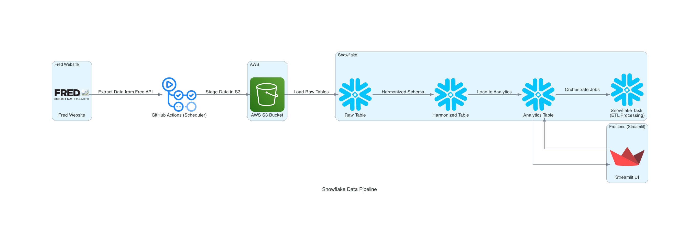

# FRED (Federal Reserve Economic Data) - Snowflake Pipelines

### Project Overview :
This repository contains the implementation of a robust data engineering pipeline designed to process financial data from the Federal Reserve Economic Data (FRED) platform, specifically focusing on U.S. Treasury yields for 10-Year and 2-Year bonds. Leveraging Snowflake's Snowpark for Python, the project provides an efficient system for extracting, transforming, and validating financial data to enable advanced analysis and reporting.

### Team Members :
- Vedant Mane
- Abhinav Gangurde
- Yohan Markose

### Resources : 
- **Streamlit Application** : [Streamlit App](https://fredanalytics.streamlit.app/)

- **Google Codelab**: [Codelab](https://codelabs-preview.appspot.com/?file_id=1jTG4u1Wsswd29oEoYj2Cy0oAIexVLM-iuCtUTEH-1QU#0)

- **Google Docs**: [Project Document](https://docs.google.com/document/d/1jTG4u1Wsswd29oEoYj2Cy0oAIexVLM-iuCtUTEH-1QU/edit?usp=sharing)

- **Video Walkthrough**: [Video](https://northeastern-my.sharepoint.com/personal/gangurde_a_northeastern_edu/_layouts/15/stream.aspx?id=%2Fpersonal%2Fgangurde%5Fa%5Fnortheastern%5Fedu%2FDocuments%2FRecordings%2FMeeting%20in%20DAMG7245%20%2D%20Team%2005%2D20250228%5F071838%2DMeeting%20Recording%2Emp4&ct=1740746170452&or=Teams%2DHL&ga=1&LOF=1&referrer=StreamWebApp%2EWeb&referrerScenario=AddressBarCopied%2Eview%2E1797764c%2D0e6c%2D4d8b%2D9b7a%2D77df3dd2626c)

### Technologies Used :
- **Streamlit** : Frontend Visual Dataset for analytics
- **AWS S3**: External Cloud Storage
- **Cloud & Storage**: Snowflake, AWS S3
- **ELT & Pipeline**: Snowflake Tasks
- **Snowflake** : Snowpark, UDF, Stored Procedures, Streams, Notebook

### Architecture Diagram :

### Workflow :

1. **Initial Account Creation and Setup** - 
To get started with the project, you need to set up the necessary accounts and configurations for both Snowflake and FRED. These accounts form the foundation for creating the data pipelines, storing data, and accessing the required datasets.

- **Snowflake** : The pipelines heavily rely on Snowflake for data storage, transformation, and orchestration.
- **FRED** : The project uses publicly available APIs from FRED (Federal Reserve Economic Data) to fetch U.S. Treasury yield data. To access these APIs, you need an API key from FRED.

2.  **Automation of data extraction** -  
Github's actions for scheduling the data extraction daily and loading data into secondary data storage in this case AWS S3 bucket.

3. **Snowflake Account Setup** - 
Upload the provided FRED_0_START.ipynb from the git in your snowflake account and run for setting up with required database level objects.

4. **Deploy Notebooks** -
Deploy the external git notebook elements in the snowflake and use the for data processing and updation in created snowflake dags.

5. **Schedule the Snowflake DAGs** -
Run the created snowflake tasks and observed the run for the data processing.

6. **Streamlit**
The processed data is observable in the rendered streamlit application

For detailed guide and steps to run the data pipelines following through the offical quickstarter guide. -
[FRED (Federal Reserve Economic Data) - Snowflake Data Pipelines Quickstarter Guide](https://docs.google.com/document/d/1jTG4u1Wsswd29oEoYj2Cy0oAIexVLM-iuCtUTEH-1QU/edit?tab=t.0) 

### Attestation :
WE ATTEST THAT WE HAVEN’T USED ANY OTHER STUDENTS’ WORK IN OUR ASSIGNMENT AND ABIDE BY THE POLICIES LISTED IN THE STUDENT HANDBOOK
